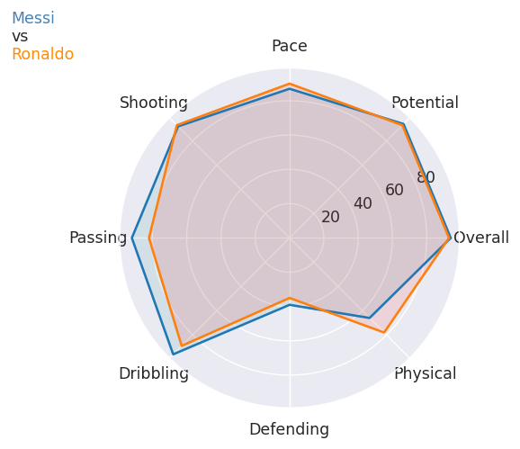
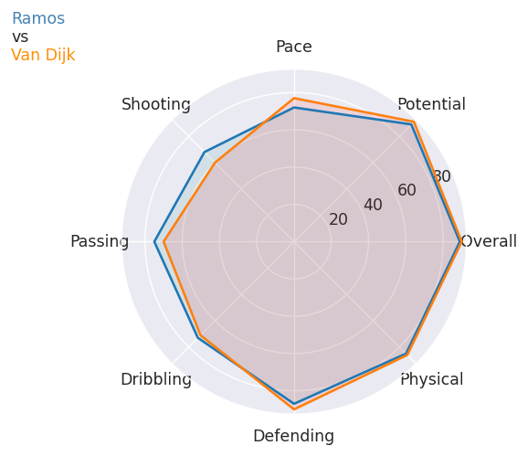
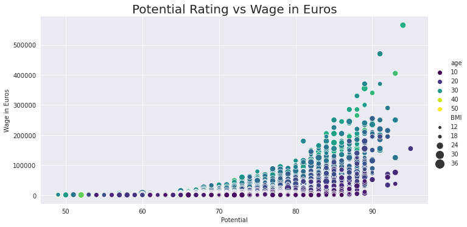
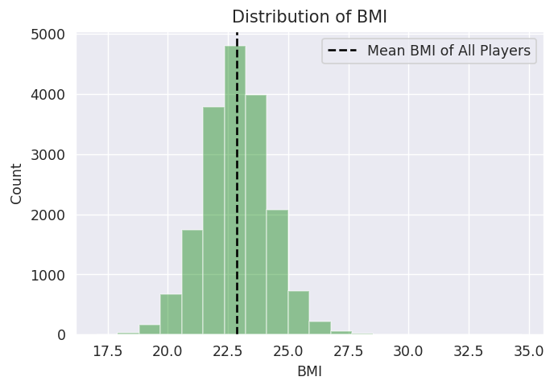
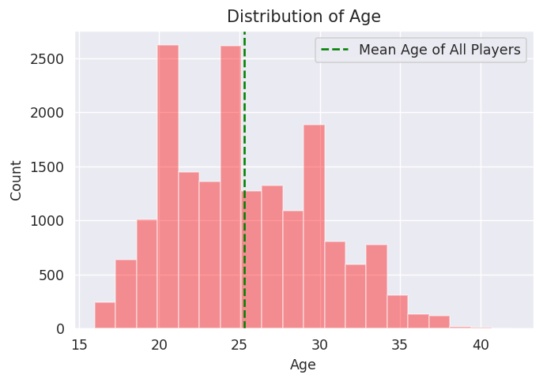
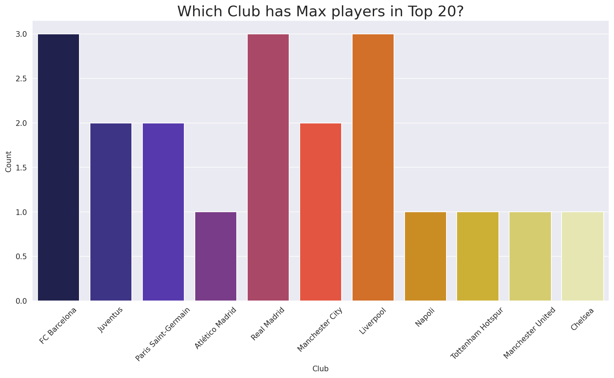
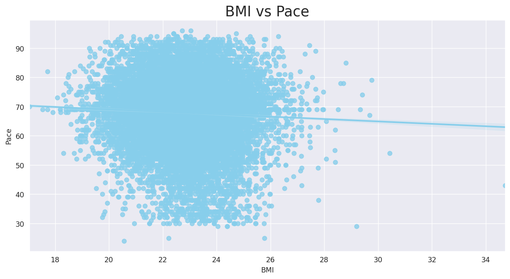

# FIFA-20

FIFA 20 is a football simulation video game published by Electronic Arts as part of the FIFA series. It is the 27th installment in the FIFA series, and was released on 27 September 2019 for Microsoft Windows, PlayStation 4, Xbox One, and Nintendo Switch. Real Madrid winger Eden Hazard was named the new cover star of the Regular Edition, with Liverpool defender Virgil van Dijk on the cover of the Champions Edition. Former Juventus and Real Madrid midfielder Zinedine Zidane was later named as the cover star for the Ultimate Edition.

Here you will find Exploratory Data Analysis with both Seaborn and Plotly.

1. First Explored and Cleaned data as per the requirements.
2. Prepared Radar Plots for comparison of Top class players.
3. Used Countplots to find some important insights.
4. Analysed relationships between many attributes using scatter and reg plots.

# HAVE A LOOK AT SOME VALUABLE INSIGHTS

For code and other insights, Please have a look at the complete Notebook - https://github.com/ashaabrizvi/FIFA-20/blob/master/fifa-eda-seaborn.ipynb

