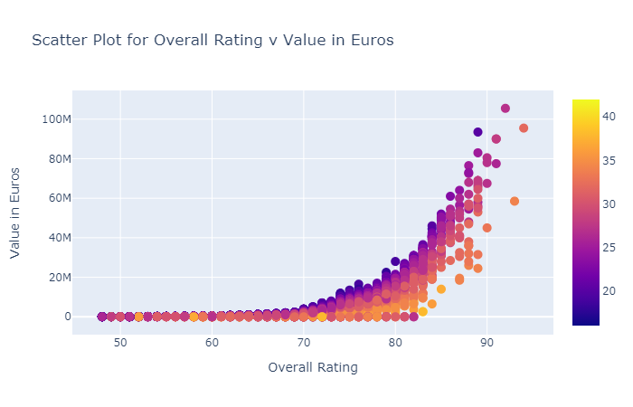
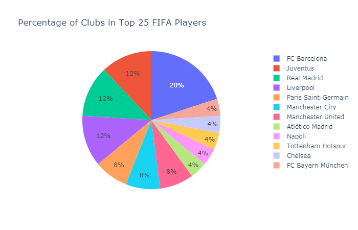
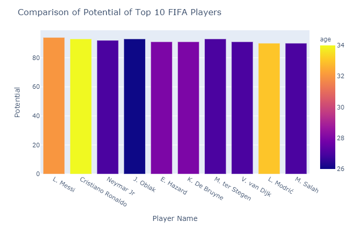
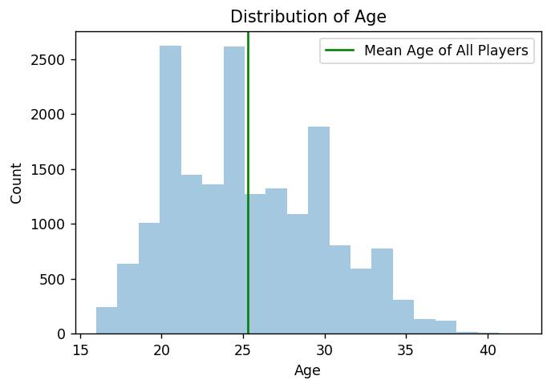
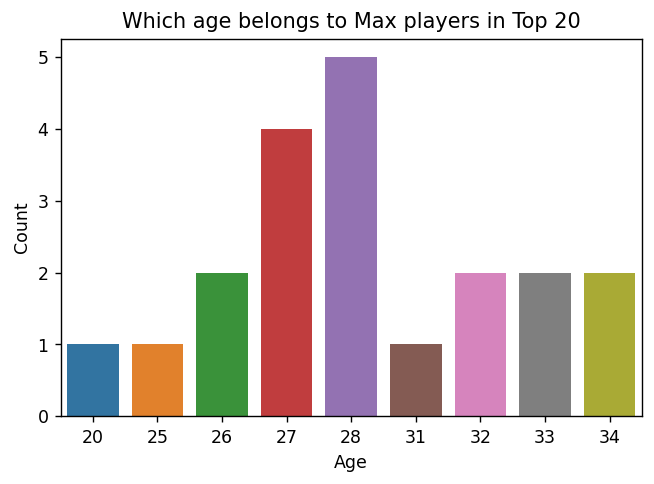
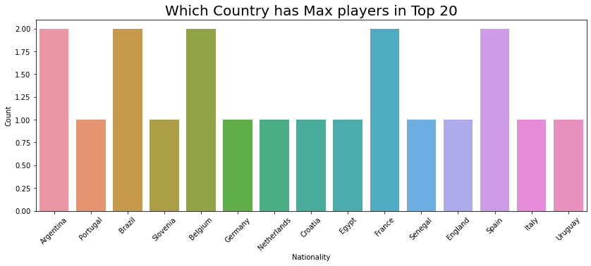
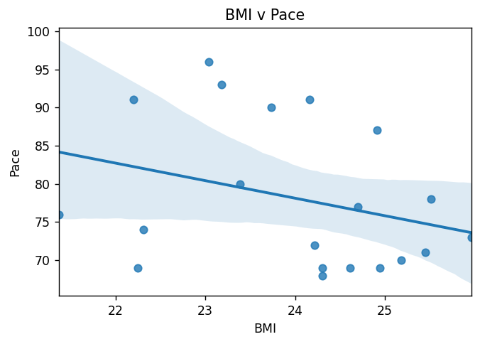
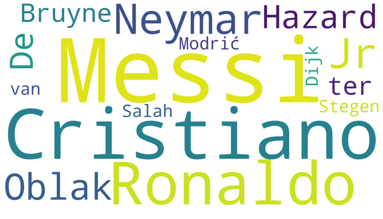

# FIFA-20

FIFA 20 is a football simulation video game published by Electronic Arts as part of the FIFA series. It is the 27th installment in the FIFA series, and was released on 27 September 2019 for Microsoft Windows, PlayStation 4, Xbox One, and Nintendo Switch. Real Madrid winger Eden Hazard was named the new cover star of the Regular Edition, with Liverpool defender Virgil van Dijk on the cover of the Champions Edition. Former Juventus and Real Madrid midfielder Zinedine Zidane was later named as the cover star for the Ultimate Edition.

Here you will find Exploratory Data Analysis with both Seaborn and Plotly.
Although Plotly graphs are not visible here as Github doesn't render iframes at the moment.
So, For that you can check my Kaggle notebook -

https://www.kaggle.com/ashaabrizvi/fifa-eda-plotly

# SOME VALUABLE INSIGHTS

For Other Insights, Please have a look at the complete Notebook.

